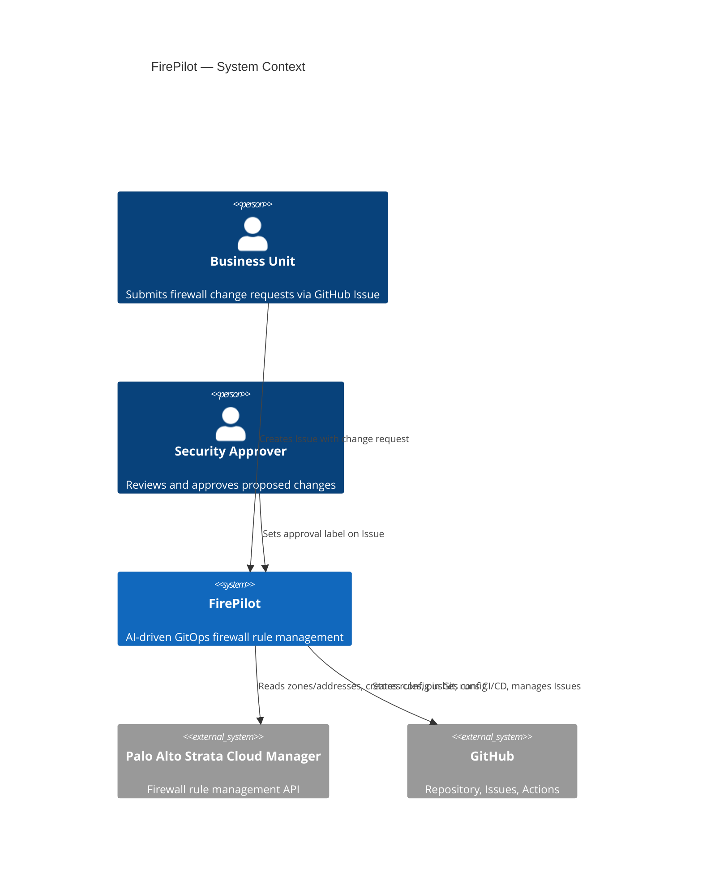
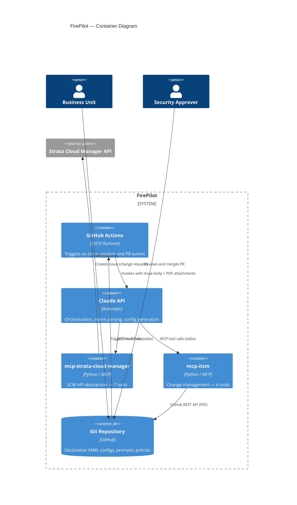
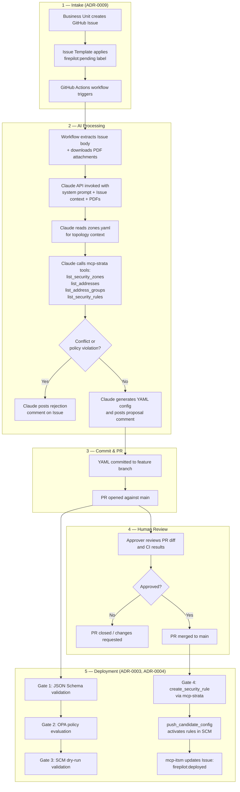
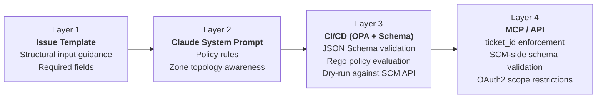
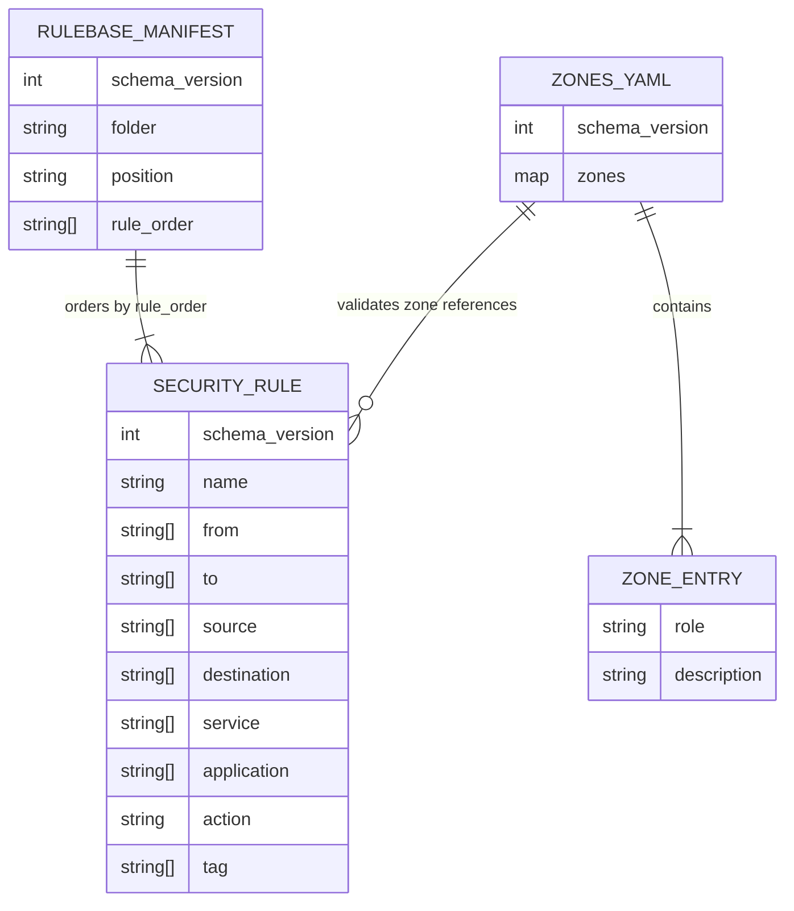
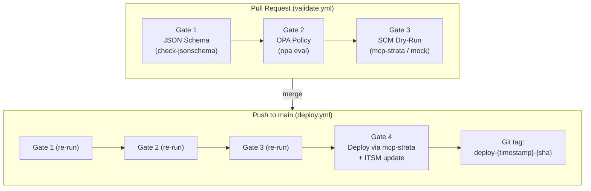
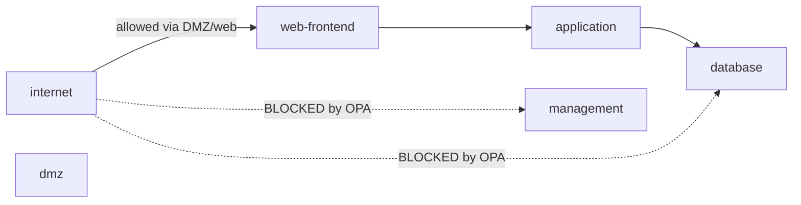

# FirePilot — Architecture

This document describes FirePilot's system architecture using the
[C4 model](https://c4model.com/) (Context, Container, Component).
All diagrams use Mermaid syntax and render natively on GitHub.

**Authoritative sources**: This document is a visual summary. The
binding decisions are recorded in [Architecture Decision Records](adr/).
When this document and an ADR conflict, the ADR is authoritative.

**ADR index**:
[ADR-0000](adr/0000-adr-format-and-process-definition.md) Process |
[ADR-0001](adr/0001-git-as-single-source-of-truth-for-firewall-configuration.md) Git as SoT |
[ADR-0002](adr/0002-mcp-over-direct-api.md) MCP over direct API |
[ADR-0003](adr/0003-cicd-pipeline-design-and-policy-validation-toolchain.md) CI/CD pipeline |
[ADR-0004](adr/0004-mcp-strata-cloud-manager-tool-interface-design.md) SCM tool interface |
[ADR-0005](adr/0005-mcp-itsm-tool-interface-design.md) ITSM tool interface |
[ADR-0006](adr/0006-mcp-server-authentication-and-credential-management.md) Credential management |
[ADR-0007](adr/0007-declarative-firewall-configuration-yaml-schema.md) YAML schema |
[ADR-0008](adr/0008-zone-topology-mapping-and-role-based-policy-validation.md) Zone topology |
[ADR-0009](adr/0009-github-issues-as-primary-firewall-change-request-interface.md) GitHub Issues intake

---

## 1 — System Context (C4 Level 1)

Who interacts with FirePilot, and what external systems does it touch?



**Key boundaries**:

- Requestors interact exclusively through GitHub Issues using a
  structured Issue Template (ADR-0009). There is no custom web UI.
- FirePilot never holds SCM or GitHub credentials in Claude's context
  window. All external access is mediated by MCP servers (ADR-0002,
  ADR-0006).
- GitHub serves three roles simultaneously: configuration repository
  (ADR-0001), ITSM backend (ADR-0005), and CI/CD runtime (ADR-0003).

---

## 2 — Container Diagram (C4 Level 2)

What are the major runtime components and how do they communicate?



### Container responsibilities

| Container | Responsibility | ADR |
|---|---|---|
| GitHub Actions | Event-driven orchestration: issue intake, CI/CD validation, deployment | ADR-0003, ADR-0009 |
| Claude API | Natural language parsing, rule generation, multi-step orchestration via MCP tools | ADR-0002 |
| mcp-strata-cloud-manager | 7 tools mapped 1:1 to SCM API endpoints; enforces `ticket_id` on writes | ADR-0004 |
| mcp-itsm | 4 tools for change request lifecycle; v1 backend is GitHub Issues | ADR-0005 |
| Git Repository | Single source of truth for firewall configuration, zone mapping, OPA policies | ADR-0001 |

### Operating modes

Both MCP servers operate in one of two modes, controlled by
`FIREPILOT_ENV` (ADR-0004, ADR-0005):

| Mode | Behaviour |
|---|---|
| `demo` | All tools return realistic fixture responses. No external API calls. |
| `live` | Tools execute against real SCM / GitHub APIs. |

---

## 3 — Component Diagram: Request Processing Flow

The end-to-end flow from change request submission to deployed rule.



---

## 4 — Constraint Layers (Defense in Depth)

FirePilot enforces security constraints at four independent layers.
Each layer operates without trusting the layers before it.



| Layer | Enforcement point | Independence guarantee | ADR |
|---|---|---|---|
| 1 — Issue Template | GitHub Issue form | Structural guidance only; not a validation gate | ADR-0009 |
| 2 — Claude Prompt | Claude's system prompt and orchestration logic | Zone topology from `zones.yaml`; does not bypass OPA | ADR-0008 |
| 3 — CI/CD | GitHub Actions: `check-jsonschema` + OPA + dry-run | Validates config files on their own merits; does not trust Claude | ADR-0003 |
| 4 — MCP / API | MCP server-side checks + SCM API validation | `ticket_id` enforced structurally; SCM rejects invalid payloads | ADR-0004, ADR-0006 |

---

## 5 — Data Model: Declarative Configuration

Firewall configuration is stored as YAML in Git (ADR-0001, ADR-0007).

### Directory structure

```
firewall-configs/
├── zones.yaml                      # Zone topology mapping (ADR-0008)
└── {folder}/                       # SCM folder name
    └── {position}/                 # pre | post
        ├── _rulebase.yaml          # Ordering manifest
        └── {rule-name}.yaml        # Individual security rule
```

### Schema relationships



### Key invariants (enforced by JSON Schema + OPA)

- `folder` and `position` in `_rulebase.yaml` must match their
  directory path
- Every entry in `rule_order` must have a corresponding `.yaml` file
  (and vice versa)
- Every zone in a rule's `from`/`to` must exist in `zones.yaml`
- Every rule must include `"firepilot-managed"` in its `tag` list
- No rule may contain `id`, `folder`, or `position` fields
- No `allow` rule may route internet → database or internet → management

---

## 6 — CI/CD Pipeline (ADR-0003)



Gates execute sequentially. Any failure blocks all subsequent gates.
The deploy workflow re-runs Gates 1–3 as a defense-in-depth measure.

### Drift Detection (ADR-0011)

A scheduled GitHub Actions workflow (`drift-check.yml`) runs daily
and compares the Git-declared configuration against live SCM state.
The comparison connects to `mcp-strata-cloud-manager` via MCP stdio,
fetches all `firepilot-managed` rules, and performs field-level
comparison against the YAML files in `firewall-configs/`.

Discrepancies are reported as GitHub Issues with the
`firepilot:drift-detected` label. If an open drift issue already
exists, the new report is appended as a comment.

Failed deployments (Gate 4 push failure) can be retried by applying
the `firepilot:retry-deploy` label to the original change request
issue. The retry workflow re-creates rules with conflict tolerance
(existing rules in candidate config are accepted) and re-attempts
the push.

---

## 7 — MCP Tool Surface

### mcp-strata-cloud-manager (ADR-0004)

| Tool | SCM Endpoint | Read/Write |
|---|---|---|
| `list_security_rules` | `GET /config/security/v1/security-rules` | Read |
| `list_security_zones` | `GET /config/network/v1/zones` | Read |
| `list_addresses` | `GET /config/objects/v1/addresses` | Read |
| `list_address_groups` | `GET /config/objects/v1/address-groups` | Read |
| `create_security_rule` | `POST /config/security/v1/security-rules` | Write (`ticket_id` required) |
| `push_candidate_config` | `POST /config/operations/v1/config-versions/candidate:push` | Write (`ticket_id` required) |
| `get_job_status` | `GET /config/operations/v1/jobs/:id` | Read |

### mcp-itsm (ADR-0005)

| Tool | GitHub Endpoint | Purpose |
|---|---|---|
| `create_change_request` | `POST /repos/{owner}/{repo}/issues` | Open new change request |
| `get_change_request` | `GET /repos/{owner}/{repo}/issues/{n}` | Poll for approval status |
| `add_audit_comment` | `POST /repos/{owner}/{repo}/issues/{n}/comments` | Append lifecycle event |
| `update_change_request_status` | `POST …/labels` + `PATCH …/issues/{n}` | Set terminal status |

### Credential isolation (ADR-0006)

- SCM: OAuth2 Client Credentials (client ID, client secret, TSG ID)
  injected via environment variables. Token acquired and refreshed
  internally by `mcp-strata-cloud-manager`.
- GitHub: Fine-grained PAT scoped to `issues: write`. Injected via
  environment variable.
- Claude never sees credentials. MCP servers are the credential
  boundary.

---

## 8 — Zone Topology Model (ADR-0008)

`firewall-configs/zones.yaml` maps SCM zone names to architectural
roles from a controlled vocabulary:

| Role | Semantic meaning |
|---|---|
| `internet` | Untrusted external network |
| `internal` | General trusted internal network |
| `dmz` | Demilitarized zone |
| `database` | Database tier |
| `application` | Application tier |
| `web-frontend` | Web-facing frontend tier |
| `endpoints` | End-user devices |
| `management` | Out-of-band management network |

OPA policies use role assignments to enforce topology constraints:



---

## 9 — Repository Layout

```
firepilot/
├── CLAUDE.md                              # Agent configuration
├── README.md                              # Project narrative, demo instructions
├── docs/
│   ├── adr/                               # Architecture Decision Records
│   ├── architecture.md                    # This file
│   └── threat-model.md                    # Security boundary documentation
├── .github/
│   ├── ISSUE_TEMPLATE/
│   │   └── firewall-change-request.yml    # Structured intake form (ADR-0009)
│   ├── workflows/
│   │   ├── drift-check.yml                # Scheduled drift detection (ADR-0010)
│   │   ├── retry-deploy.yml               # Push retry for failed deployments (ADR-0010)
│   │   ├── process-firewall-request.yml   # Issue → Claude processing → commit → PR
│   │   ├── validate.yml                   # PR validation (Gates 1–3)
│   │   └── deploy.yml                     # Merge deployment (Gates 1–4)
│   └── scripts/
│       ├── process_firewall_request.py    # Issue processing, YAML extraction, PR creation
│       └── update_rulebase_manifest.py    # _rulebase.yaml manifest update
├── mcp-servers/
│   ├── mcp-strata-cloud-manager/          # SCM API integration (ADR-0004)
│   └── mcp-itsm/                          # ITSM integration (ADR-0005)
├── firewall-configs/                      # Declarative YAML configs (ADR-0007)
│   ├── zones.yaml                         # Zone topology mapping (ADR-0008)
│   └── {folder}/{position}/               # Rule directories
├── prompts/                               # Claude system prompts, versioned
│   └── examples/                          # Annotated prompt examples
├── ci/                                    # Validation toolchain
│   ├── schemas/                           # JSON Schemas
│   ├── policies/                          # OPA Rego policies + tests
│   ├── scripts/                           # Gate scripts
│   └── fixtures/                          # Test fixtures
└── demo/                                  # Local demo setup
    ├── Dockerfile
    ├── docker-compose.yml
    ├── demo-validate.sh
    └── example-issue.md
```

---

## 10 — Technology Stack

| Concern | Technology | Rationale |
|---|---|---|
| Orchestration | Claude API (Anthropic) | Natural language parsing + multi-step tool orchestration |
| Integration protocol | MCP (Model Context Protocol) | Structured tool interface; credential isolation; mockability (ADR-0002) |
| MCP servers | Python 3.12+ | Consistent stack; type-annotated; `structlog` for audit logging |
| Policy validation | OPA with Rego | Declarative, testable, version-controlled policy-as-code (ADR-0003) |
| Schema validation | JSON Schema (Draft 2020-12) | Structural validation before policy evaluation |
| Configuration format | YAML | Human-readable declarative config; validated against JSON Schema (ADR-0007) |
| CI/CD | GitHub Actions | Event-driven; no always-on infrastructure; integrated with GitHub Issues |
| Source of truth | Git (GitHub) | Immutable audit trail; branch protection; PR-based review (ADR-0001) |
| ITSM (v1) | GitHub Issues | Zero infrastructure; co-located with config repo; label-based workflow (ADR-0005) |
| Firewall platform | Palo Alto Strata Cloud Manager | Enterprise NGFW management API (ADR-0004) |
